# Jeopardy Multiplayer Game

Jeopardy Multiplayer is a game that can be played by two players who are connected with the help of the Socket.IO library. The players choose 4 categories and then answer questions. At the end of the game, there is a winner or the game finishes tied. In both cases the players gain their points and they are added to their total score. The Home Page shows a Leaderboard where the top 10 players render. The aim of every player should be to take the first place!

Also, there is an Admin account, so the owner of the game can create new categories and questions. The admin can play a game as well, but their score will not be shown in the Leaderboard. The purpose of that is the admin to be able to test the game and more specifically, whether all categories and questions render properly.

## Features

- ### Socket.IO
- ### React Redux
- ### React RTK Query
- ### Responsive Design
- ### Tailwind Components
- ### MongoDB

## Click the video below to watch the demo of the game:

[](https://youtu.be/KD0SuQKmQEA)

## New Design (released January 2026):

- #### Authentication Page (Login/Register):

  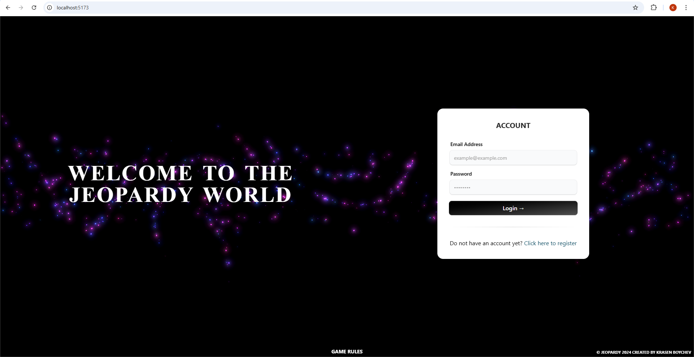
  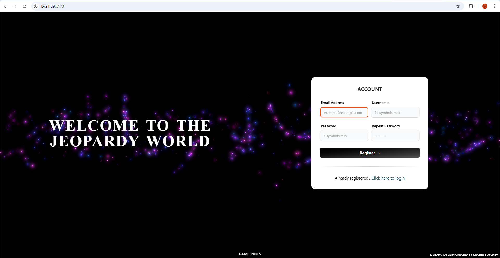

- #### Home Page:

  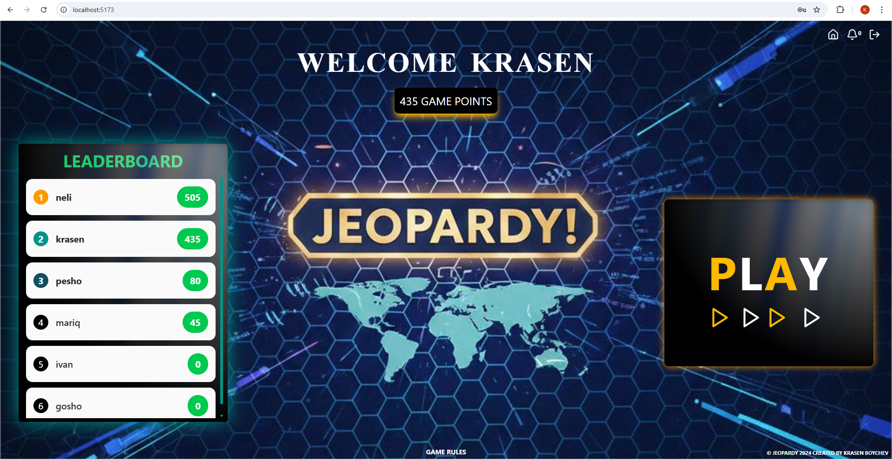

- #### Play Page:

  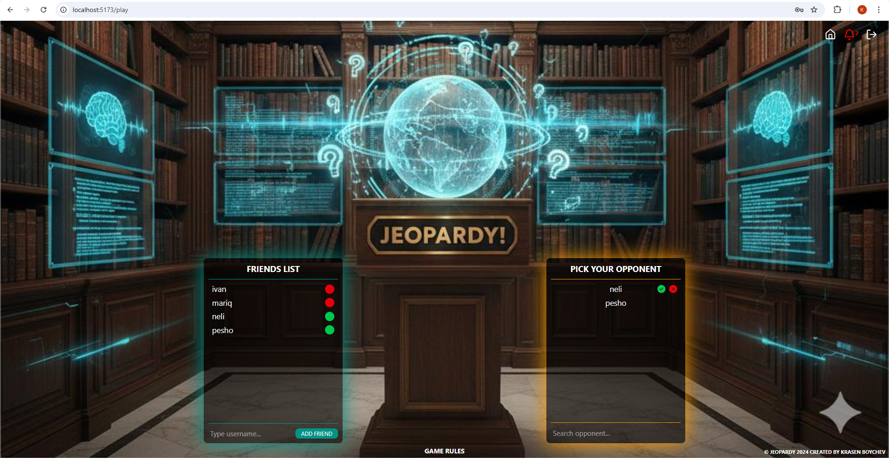
  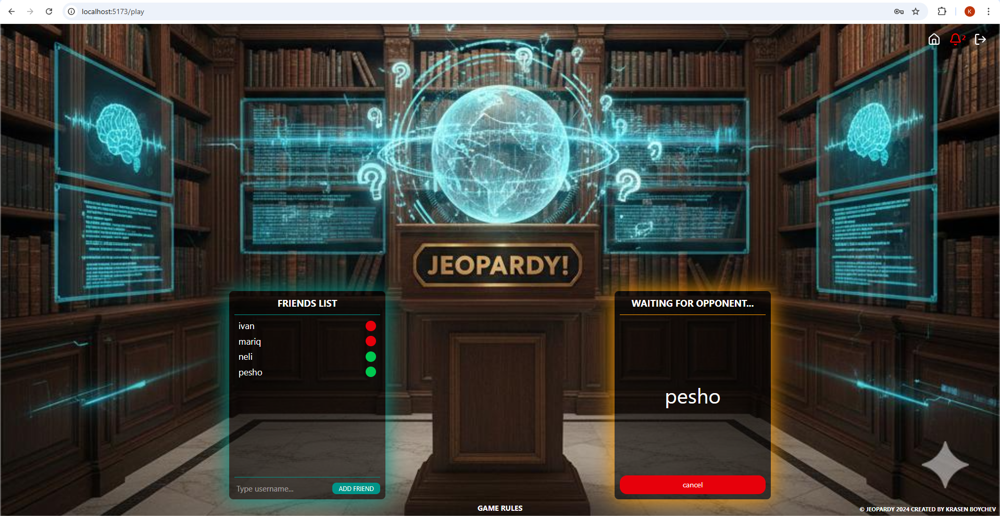

- #### Game Pages:

  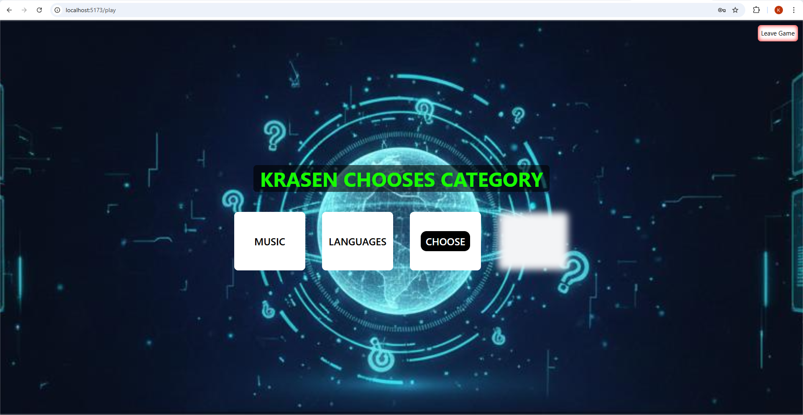
  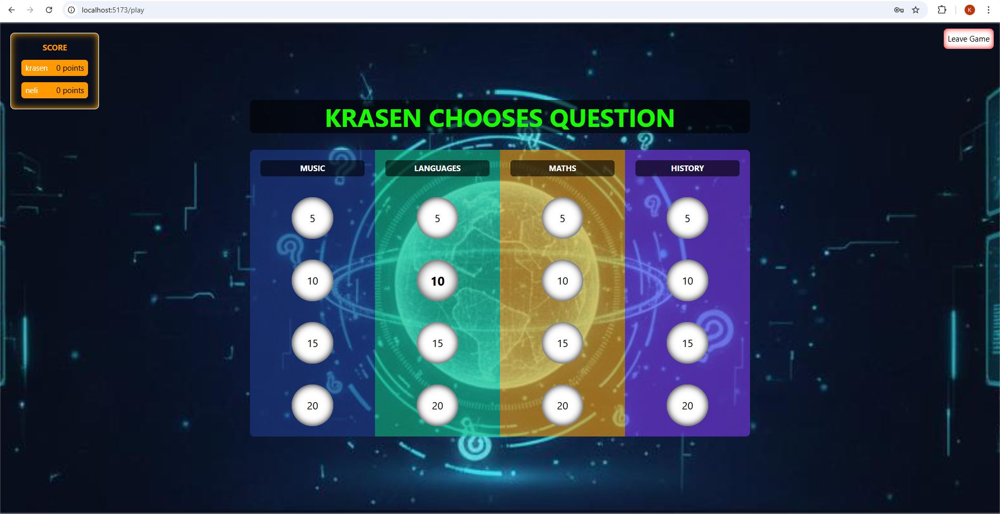
  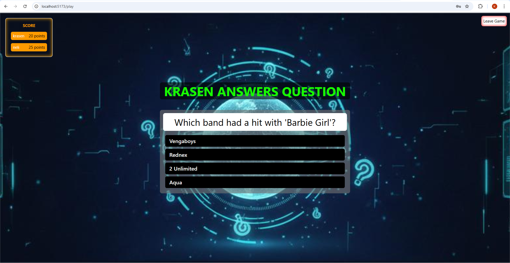
  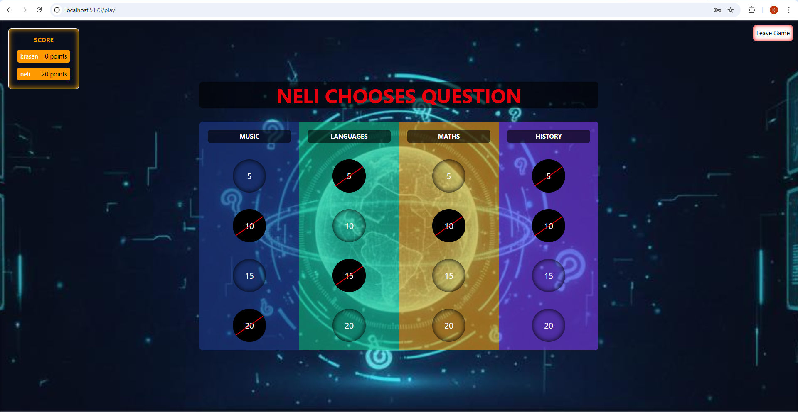
  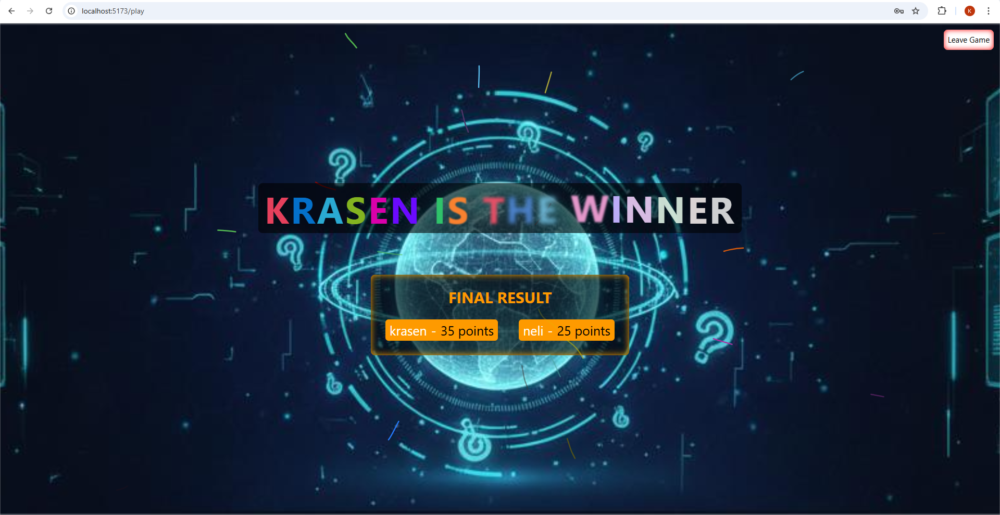
  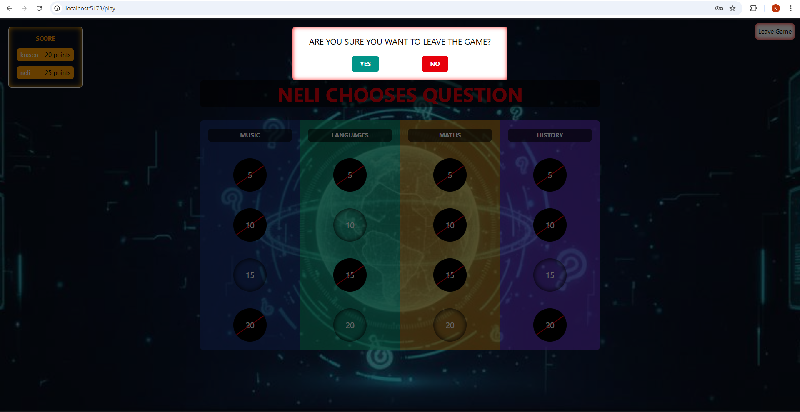

- #### About Page:

  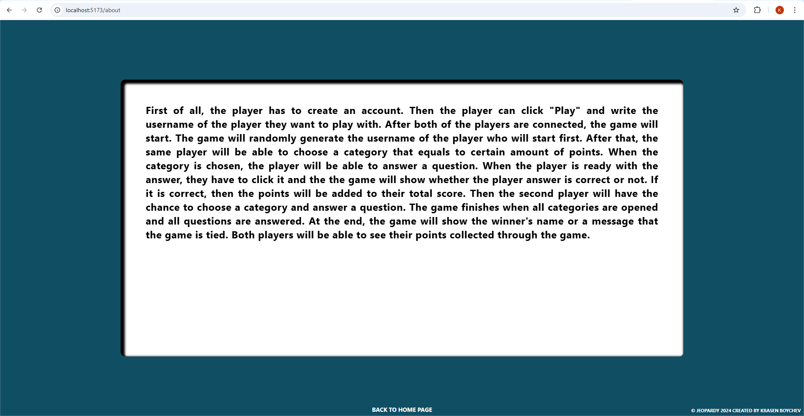

- #### Notifications:

  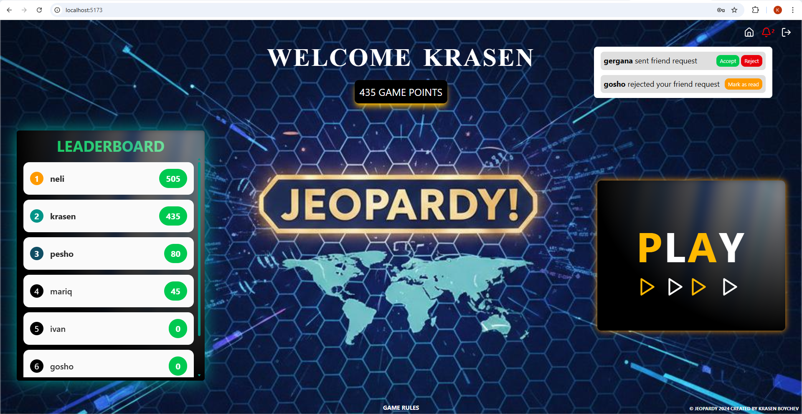

- #### If a user logs in from another device, a message shows in the Play Page:

  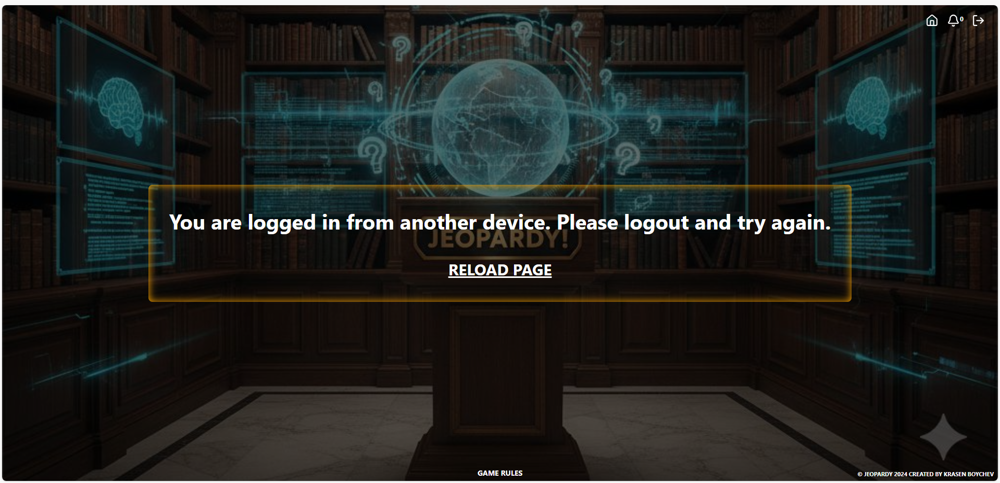

- #### Admin Pages:

  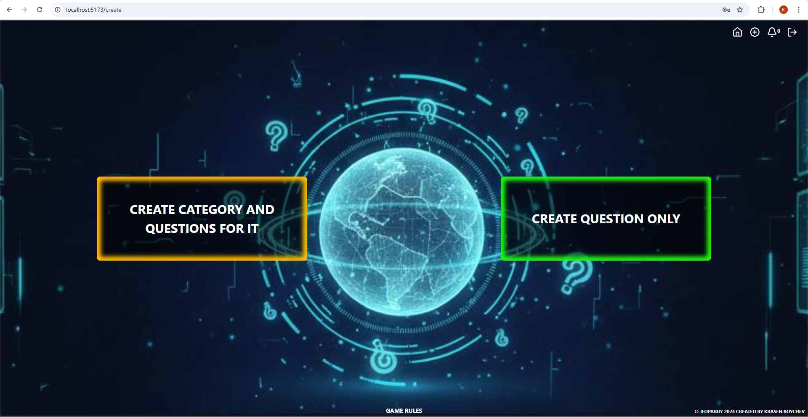
  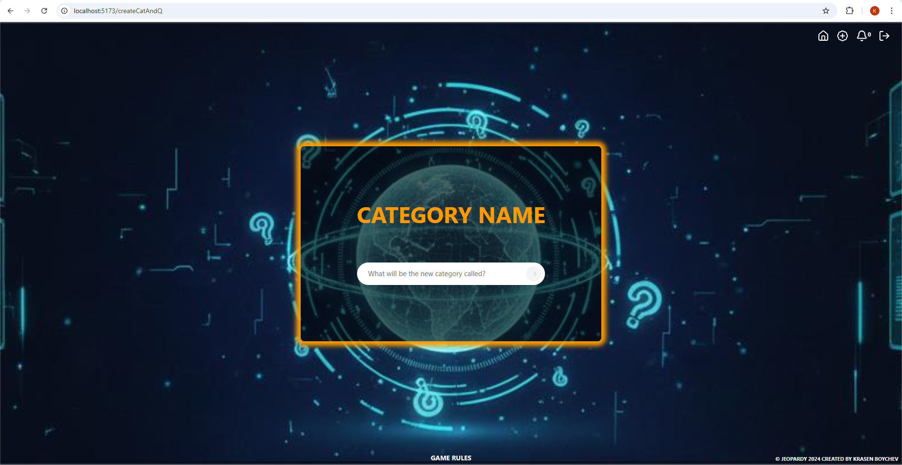
  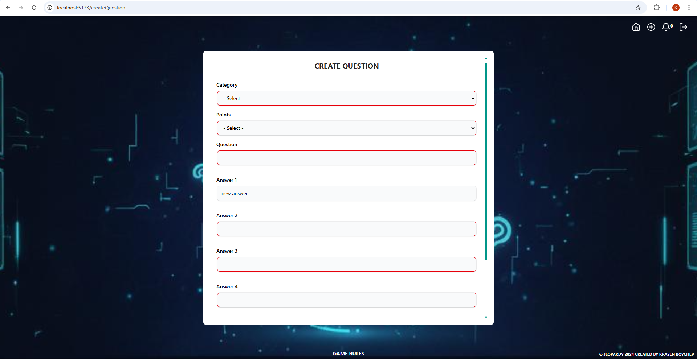

## Getting Started

### Installing

- Clone the repository or download all files.

### Executing program

- Run Client

```
cd client
```

```
npm install
```

```
npm run dev
```

- Run Server

```
cd server
```

```
npm install
```

```
npm start
```
